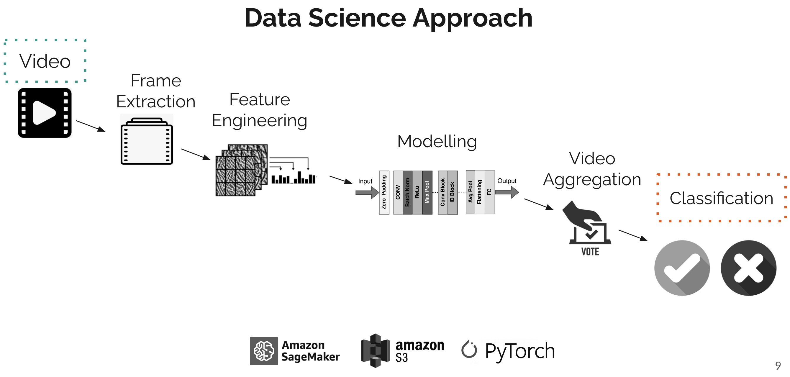

## 🚀 短视频滤镜检测器
**使用 CNN 模型训练短视频分类器，检测视频是否加过美颜滤镜**
- 用 **PyTorch** 和 **scikit-learn** 搭建模型，用 **AWS SageMaker** PaaS 服务部署训练任务
- 基于预训练的 **ResNet101** 模型添加额外卷积层，再用输入图像数据做训练微调
- 对普通三通道 RGB 图像增加 **PRNU** 噪点信息通道，使模型能检测出滤镜对噪点层的影响
- 尝试多种 **CNN** 模型结构和不同的图像预处理组合，并做大量超参数调优

---

## 🚀 即时消息系统升级改造
**为 IM 即时消息 SaaS 服务商公司实现新功能**
- 用字典树实现消息的关键词过滤服务，与消息模块通过 **Thrift RPC** 通信
- 用 **Reactor Netty** HTTP 客户端实现了一套响应式 **Java SDK**，用来管理消息元数据
- 为满足 **GDPR** 要求，开发了一个信封加密库对用户数据加密，并使用 **AWS KMS** 管理密钥
- 改造原有的 **JWT token** 结构，以对新收购公司的用户做统一鉴权处理
- 完善现有代码中千疮百孔的单元测试，并使用 **wrt Lua** 脚本做压力测试

---

## 🚀 数据质量扫描器
**在原有数据治理软件的基础上，增添自动数据质量扫描功能**
- 支持多种关系型数据库，如 **Oracle**, **SQL Server**, **OceanBase** 和 **PolarDB**
- 使用 **ANTLR** 做自定义命令语法解析，使用户可用简洁的命令指定数据质量扫描规则
- 用 **Spring Schedule** 实现定时任务，用户可在网页端界面调度多任务运行
- 使用 **Spring JavaMailSender** 实现在任务状态更新时，邮件通知用户

---

## 🚀 电商平台创业
**目标是向伊利诺伊州消费者销售烟具，我是3个创始程序员之一**
- 从零到一搭建 **CI/CD pipeline**, 实现服务端在 **AWS ECS** 上的容器化和弹性化部署
- 使用 **Node.js** 和 **Express.js** 实现用户、存货和订单管理 API
- 数据库使用 **MongoDB**, ORM 框架使用 **mongoose**
- 用 **Socket.io** 库实现网页端基于 **WebSocket** 的用户间消息通讯功能
- 集成第三方 OCR 和身份证验证服务，基于驾照对用户做实名认证
- 同时负责对初级程序员的招聘，以及与 freelancer 前端开发者的对接工作